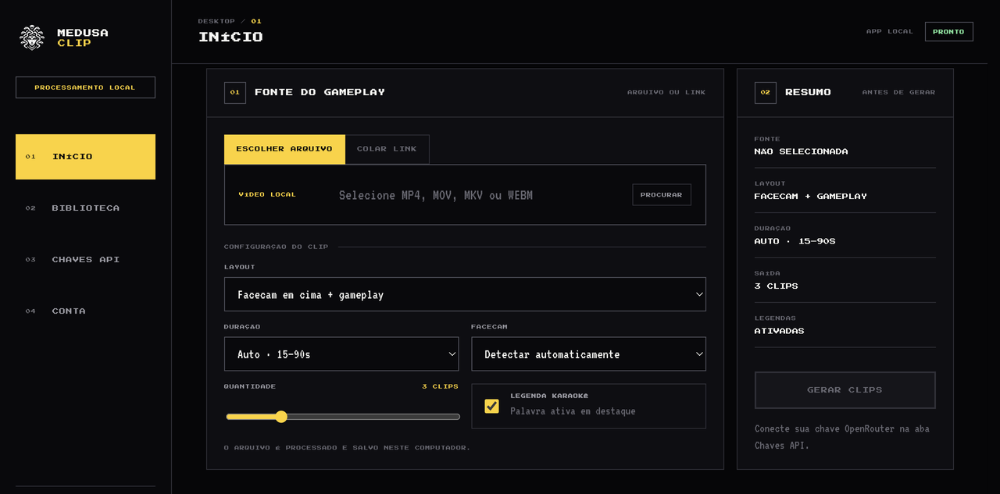

<div align="center">


# Medusa Clip

**Cortes verticais 9:16 nível Opus Clip, feitos pra gameplay — grátis, open source e 100% no seu PC.**

[](https://github.com/Edualnog/medusa-clip/releases/latest)
[](LICENSE)
[](https://github.com/Edualnog/medusa-clip/releases)


[](https://discord.gg/jqUDqRt8)

[**🌐 medusaclip.com**](https://medusaclip.com) · [**⬇️ Download**](#download) · [**💬 Discord**](https://discord.gg/jqUDqRt8) · [**💛 Apoiar**](https://github.com/sponsors/Edualnog)

<br />



</div>

---

O **Medusa Clip** transforma gameplays longos em clipes verticais 9:16 prontos pra
TikTok, Reels e YouTube Shorts. O motor é **especializado em gameplay**: combina áudio,
movimento e visão pra achar clutch, fail, clímax e reação — com hook, legenda karaokê e
enquadramento automático.

Tudo roda **no seu computador**: o gameplay **nunca sobe pra nuvem**, **não tem cadastro
nem login**, e a IA usa a **sua própria chave**. É **grátis** e **open source**.

## ✨ Recursos

- **🎮 Especialista em gameplay** — não trata como vídeo de fala qualquer; lê áudio, movimento e frames pra reconhecer o que importa.
- **🔒 Sem cadastro, 100% local** — nada de login, e-mail ou senha; o vídeo é processado e fica no seu PC, sem servidor nosso.
- **🆓 Grátis e open source** — sob a licença AGPL-3.0, sem assinatura e sem paywall.
- **🔑 Sua chave de IA (BYO key)** — OpenRouter, OpenAI ou Anthropic; você paga centavos direto ao provedor.
- **✂️ Pós-produção automática** — hook (manchete), legenda karaokê palavra a palavra e reframe em 2 layouts (facecam + gameplay · ou foco na ação).
- **🖥️ Self-contained** — macOS, Windows e Linux; o instalador já traz o motor, `ffmpeg` e `ffprobe`. Sem instalar Python nem dependências.

## ⬇️ Download

Grátis. Os links apontam sempre pra **versão mais recente** — baixe pelo botão ou cole o comando.

**macOS (Apple Silicon / ARM64)** — [baixar `.dmg`](https://github.com/Edualnog/medusa-clip/releases/latest/download/MedusaClip-mac-arm64.dmg)

```bash
curl -L -o MedusaClip.dmg https://github.com/Edualnog/medusa-clip/releases/latest/download/MedusaClip-mac-arm64.dmg && open MedusaClip.dmg
```

**Windows 10/11 (x64)** — [baixar `.exe`](https://github.com/Edualnog/medusa-clip/releases/latest/download/MedusaClip-win-x64.exe)

```powershell
iwr https://github.com/Edualnog/medusa-clip/releases/latest/download/MedusaClip-win-x64.exe -OutFile MedusaClip.exe; .\MedusaClip.exe
```

**Linux (x64)** — [baixar `.AppImage`](https://github.com/Edualnog/medusa-clip/releases/latest/download/MedusaClip-linux-x86_64.AppImage)

```bash
curl -L https://github.com/Edualnog/medusa-clip/releases/latest/download/MedusaClip-linux-x86_64.AppImage -o MedusaClip.AppImage && chmod +x MedusaClip.AppImage && ./MedusaClip.AppImage
```

Todas as versões em [Releases](https://github.com/Edualnog/medusa-clip/releases). Os builds
ainda **não são assinados** — na primeira abertura, no macOS clique com o botão direito
no app → **Abrir**; no Windows, em **Mais informações → Executar assim mesmo**.

## ⚙️ Como funciona

```text
vídeo local ou link público
  → ingestão (download h264 ≤1080p) e leitura de metadados
  → extração de áudio
  → transcrição com timestamps (GPU no Mac/Windows quando disponível; CPU senão)
  → sinais de energia e movimento → seleção dos melhores momentos
  → triagem + julgamento multimodal (OpenRouter / OpenAI / Anthropic), em paralelo
  → 2 layouts: facecam no topo + blur · ou gameplay tela cheia + blur
  → legenda karaokê + hook (manchete), no mesmo encode (FFmpeg local)
  → biblioteca local de clipes + manifest.json
```

## 🔐 Privacidade e custos

- O vídeo é processado e salvo **localmente** no seu computador.
- **Sem cadastro, sem conta, sem servidor nosso** — nenhum gameplay precisa sair do seu PC.
- A chave de IA fica **cifrada no seu dispositivo** e fala direto com o provedor escolhido.
- Você paga o consumo de IA **direto ao provedor** (OpenRouter / OpenAI / Anthropic).

**Custo na prática:** centavos por corte. Num teste com os modelos padrão, um vídeo de
~10 min gerou 4 cortes por **poucos centavos de dólar no total**. O valor varia com o
provedor/modelo e o tamanho do vídeo, cobrado direto pelo provedor na sua chave.

## 💛 Apoie o projeto

O Medusa Clip é grátis e open source, no espírito de projetos como o Blender. Se ele te
ajuda, considere apoiar (sempre opcional, nunca um paywall) pelo **[GitHub Sponsors](https://github.com/sponsors/Edualnog)**
— mensal ou único, você escolhe o valor. Compartilhar com quem joga e contribuir no GitHub também ajuda muito.

## 🛠️ Desenvolvimento

### Motor Python (`agent/`)

Requisitos: Python 3.11+, FFmpeg e FFprobe.

```bash
cd agent && make setup && make test
# CLI:
.venv/bin/medusacut "https://youtube.com/watch?v=..." --out out --clips 3
```

### Aplicativo desktop (`desktop/`)

Rodar **do código**, na sua máquina (igual à produção). Pré-requisitos: **Node.js 18+**
e **Python 3.11** (o motor é Python empacotado; `ffmpeg`/`ffprobe` vêm pelo `npm`).

```bash
cd desktop
npm install        # Electron + ffmpeg/ffprobe
npm run engine     # prepara o motor (Python -> binário) em desktop/engine/ — só na 1ª vez (alguns min)
npm start          # abre o app
```

> A pasta `desktop/engine/` não vai pro git, então **`npm run engine` é obrigatório num
> clone novo** — sem ele o app abre mas não gera cortes. Mexeu no motor (`agent/`)? rode
> `npm run engine` de novo. Mexeu só na interface? basta reabrir com `npm start`.

```bash
# instalador do sistema atual (.dmg/.exe/.AppImage):
bash scripts/build_app.sh
```

Passo a passo detalhado (pré-requisitos, ciclo de dev, rodar só o motor): **[docs/SETUP.md](docs/SETUP.md)**.

### Site (`web/`)

```bash
cd web && npm install && npm run dev
```

## 🤝 Contribuindo

Toda ajuda é bem-vinda — código, bug, ideia, tradução ou divulgação. 💛

- **Por onde começar:** veja as [issues abertas](https://github.com/Edualnog/medusa-clip/issues), em especial as marcadas [`good first issue`](https://github.com/Edualnog/medusa-clip/labels/good%20first%20issue).
- **Bate-papo:** entra no nosso [**Discord**](https://discord.gg/jqUDqRt8) pra conversar com a comunidade e tirar dúvidas.
- **Bug ou ideia:** abra uma [issue](https://github.com/Edualnog/medusa-clip/issues/new/choose) (tem template). Dúvidas e conversas vão pro [Discord](https://discord.gg/jqUDqRt8) ou pras [Discussions](https://github.com/Edualnog/medusa-clip/discussions).
- **Código:** faça um **fork** → crie uma **branch** → assine os commits com `git commit -s` (**DCO**, exigido pelo CI — ver [DCO.md](DCO.md)) → abra um **Pull Request**.
- **Antes do PR:** rode os testes do motor (`cd agent && make test`) e mantenha os princípios do projeto — **local-first**, **sem cadastro**, **BYO key**.

O guia completo está no **[CONTRIBUTING.md](CONTRIBUTING.md)**. Contribuições entram sob a licença **AGPL-3.0** (sem CLA; usamos DCO).

## 📁 Estrutura

```text
agent/      motor Python — pipeline de vídeo e testes (empacotado como binário)
desktop/    aplicativo Electron (o produto) + empacotamento multiplataforma
web/        landing estática (Next.js) — apresentação, downloads e página de apoio
docs/       arquitetura, setup e textos legais
```

## 📄 Licença

Open source sob **[GNU AGPL-3.0](LICENSE)**. Você pode usar, estudar, modificar e
redistribuir — desde que derivados (inclusive servidos pela rede) continuem abertos sob
a mesma licença. Componentes de terceiros nos builds (ex.: `ffmpeg`) seguem suas próprias
licenças. As marcas "Medusa Clip"/"medusaclip.com" e os logos não entram na licença de código.

<div align="center">
<sub>Feito pra criadores de gameplay · sem cadastro · no seu PC.</sub>
</div>
