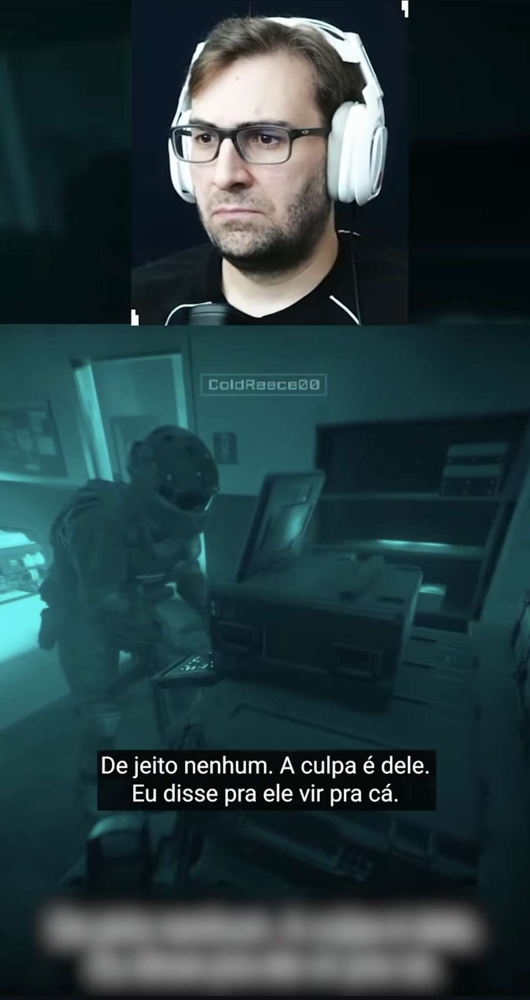

# Estilo-alvo dos cortes — referência canônica

> Este é **o modelo principal** que o motor deve reproduzir. Quando um default,
> layout ou estilo de legenda for alterado, ele tem que continuar batendo com esta
> referência. Não é treino de ML (o motor é heurística + LLM por prompt) — é a
> **especificação visual-alvo** que guia defaults e prompts.

## Referência

`assets/target_style_model1.jpg` (1080×2037, print do dono). Definida como referência
principal em 2026-06-19. Vertical 9:16, gameplay de FPS tático com facecam.

## Anatomia do corte-alvo

| Elemento | Na referência (model 1) | Default atual no motor | Bate? |
|---|---|---|---|
| Canvas | vertical 9:16 | `1080×1920` (`compose.TARGET_W/H`, `karaoke.W/H`) | ✅ |
| Layout | facecam retangular no topo, gameplay embaixo | `facecam_top_gameplay_bottom` | ✅ |
| Altura do facecam | faixa superior ≈ 1/3 da altura | `FACECAM_H = 640` (≈33% de 1920) | ✅ |
| Facecam | rosto centralizado, crop limpo | `overlay` centralizado na faixa | ✅ |
| Gameplay | preenche o resto, sem barras | `scale=...:increase` (preenche) | ✅ |
| Posição da legenda | terço inferior (~75–80% da altura) | `caption_y = 0.80` / `Y_CENTER_FRAC = 0.80` | ✅ |
| Estilo da legenda | sentence-case, branca, em caixa preta sólida | CAIXA ALTA, Impact, contorno preto, palavra ativa amarela (karaokê) | ➖ **divergência intencional** (ver abaixo) |

## Escopo da referência: layout, NÃO legenda

**Decidido (2026-06-19):** a model 1 é a referência de **layout/enquadramento** —
facecam no topo, gameplay embaixo, posição da legenda. O **estilo** da legenda em si
NÃO segue a model 1.

A legenda da model 1 é "limpa" (caixa-baixa, branco, em caixa preta sólida). O motor,
de propósito, faz o estilo **karaokê gamer** que o dono pediu em outro print
(`caption/karaoke.py`): CAIXA ALTA, fonte Impact pesada, contorno preto grosso, e a
**palavra ativa em amarelo** (`COLOR_ACTIVE = (255,209,26)`), palavra a palavra. Isso
é intencional e **fica como está** — não tratar como bug nem "consertar" pra bater com
a model 1.

## Onde isto vive no código

- Layout / facecam: `src/medusacut/reframe/compose.py` (`render_facecam_layout`, `FACECAM_H`).
- Resolução do layout default: `pipeline._resolve_layout` (`facecam_top_gameplay_bottom`).
- Legenda: `src/medusacut/caption/karaoke.py` (fonte, cor, stroke, `Y_CENTER_FRAC`).
- Detecção de facecam (pra ativar o split): `reframe/facecam.py` + `facecam_vlm.py`.
